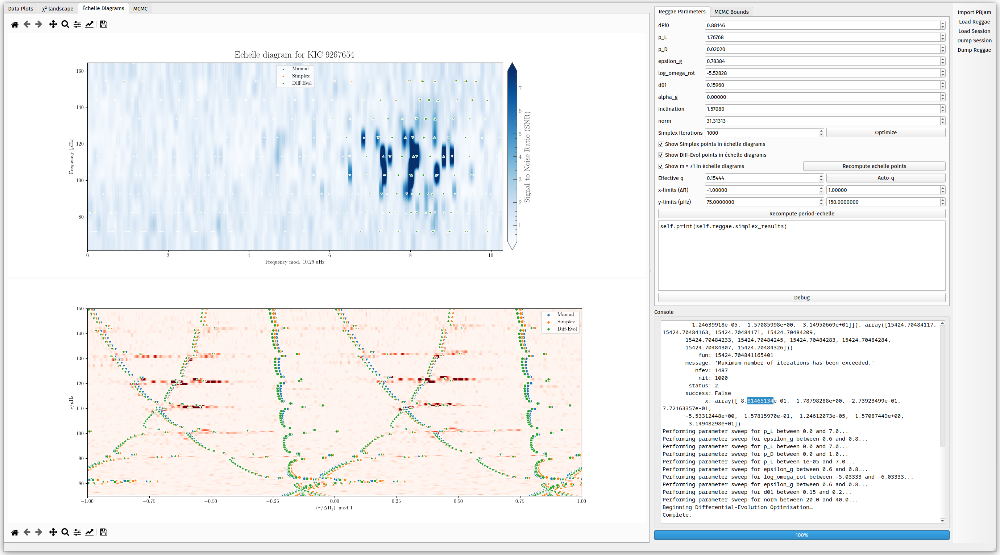

# Reggae: Dipole modes from `pbjam`

## Generative model for mode frequencies

We implement a generative model for dipole gravitoacoustic mixed modes using the parameterisation of Ong & Basu (2020). At present, the frequency-dependent coupling strength is described with two parameters (one for each of the two matrices entering into the parameterisation), with a conversion to the asymptotic $q$ provided by an expression in Ong & Gehan (2023). This expression is in turn used to generate stretched echelle power plots for diagnostic purposes.

In full, the generative model accepts the following parameters:

- $\Delta\Pi_0$, the notional period spacing of the g-mode cavity; this is related to the period spacing of any given $\ell$ as $\Delta\Pi_\ell = \Delta\Pi_0 / \sqrt{\ell(\ell + 1)}$.
- $p_L$ and $p_D$, the two coupling parameters described above.
- $\epsilon_g$, a g-mode phase offset.
- $\log \left(\delta\omega_\mathrm{rot, g} / \mathrm{\mu Hz}\right)$ and $\log \left(\delta\omega_\mathrm{rot, p} / \mathrm{\mu Hz}\right)$ --- the implementation of the PSD model (below) accepts separate values of the core (g-mode) and envelope (p-mode) rotational splittings. The pure p- and g-modes are split into multiplets separately before mode-coupling calculations are performed, thereby fully accounting for near-degeneracy asymmetric rotational splittings.
- $\delta_{01}$, an additional phase offset for the dipole p-modes relative to the asymptotic solution found by pbjam.
- $\alpha_g$, a curvature parameter for the g-modes (mirroring that of the p-modes in pbjam's asymptotic parameterisation).
- $i$, the inclination of the rotational axis.

## PSD Model

The above parameters generate a set of dipole-mode frequencies. These parameters are fitted to the power spectrum in a fashion analogous to pbjam's "asymptotic peakbagging" step, whereby the generative model is used to construct a model power spectrum which is compared directly to the observational power spectrum, in order to constrain the model parameters. In order to make the likelihood function more amenable to optimisation and sampling, the linewidths of this artifical model PSD are deliberately broadened in a uniform manner (by default, by $1/200 \Delta\nu$) --- this has the effect of smoothing out the likelihood landscape, thereby alleviating the issue of trapping in tight local minima caused by the very narrow linewidths of the g-dominated mixed modes.

## GUI

In addition to a `DipoleStar` class (analogous to `star` in `pbjam`), we provide a GUI console for fine-tuning an initial guess to these asymptotic parameters. The primary use case for this is to refine the search space (i.e. reduce size of the prior volume) for more expensive computational methods, such as nested sampling. Simple tasks, such as simplex and genetic-algorithm optimisation, can also be performed from within the GUI.

## Contributors

- Joel Ong (Mode frequency generative model + GUI)
- Martin B. Nielsen (PSD model)
- Guy R. Davies
- Emily Hatt
