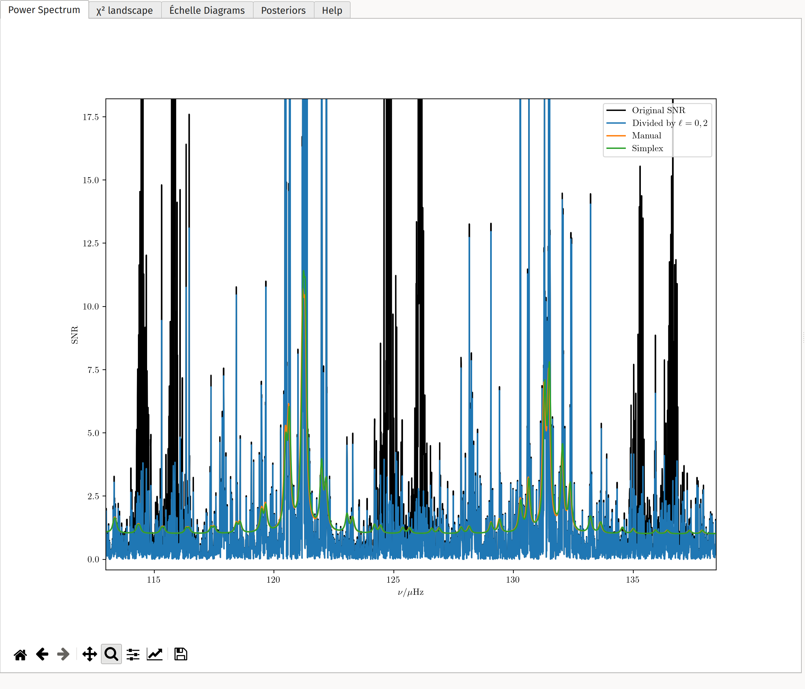
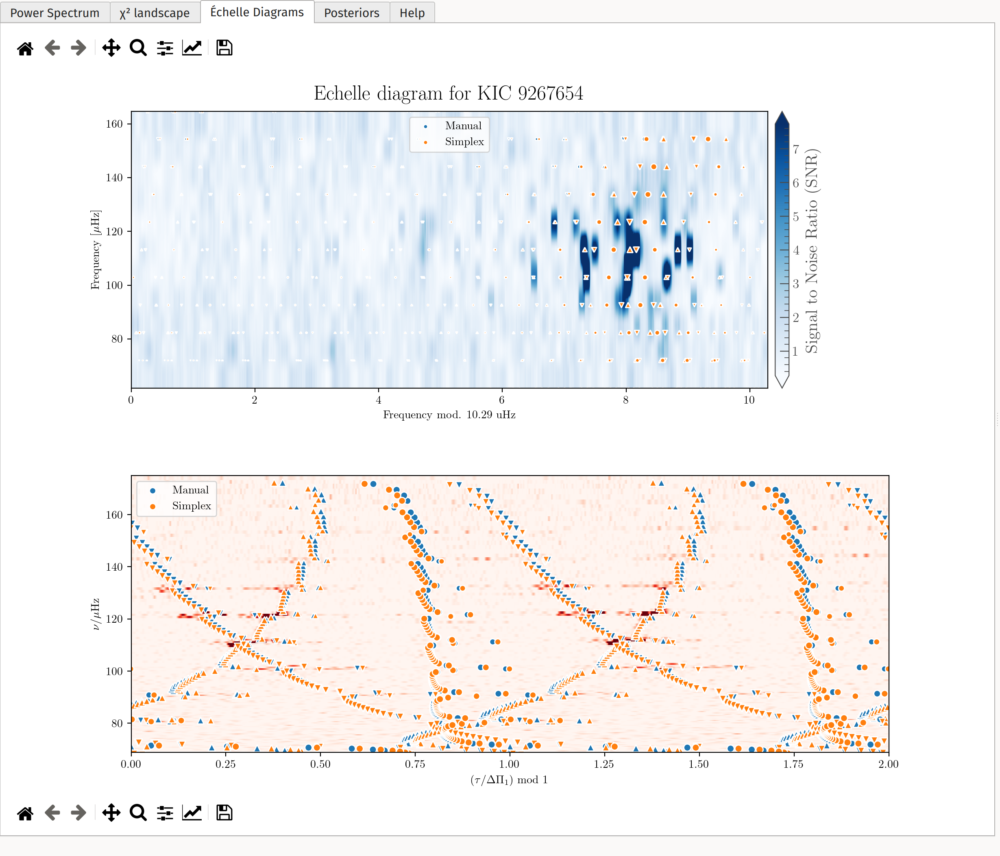
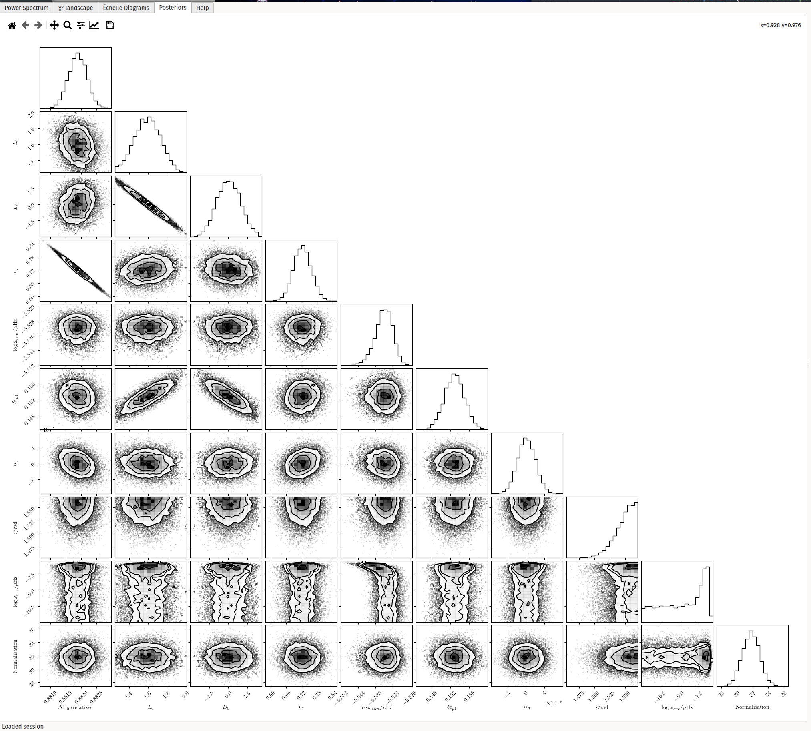
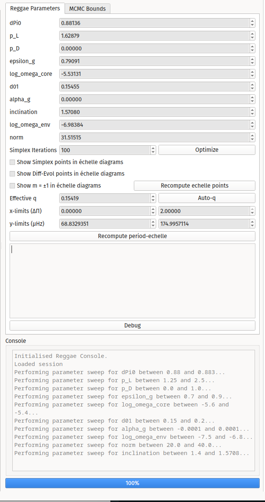
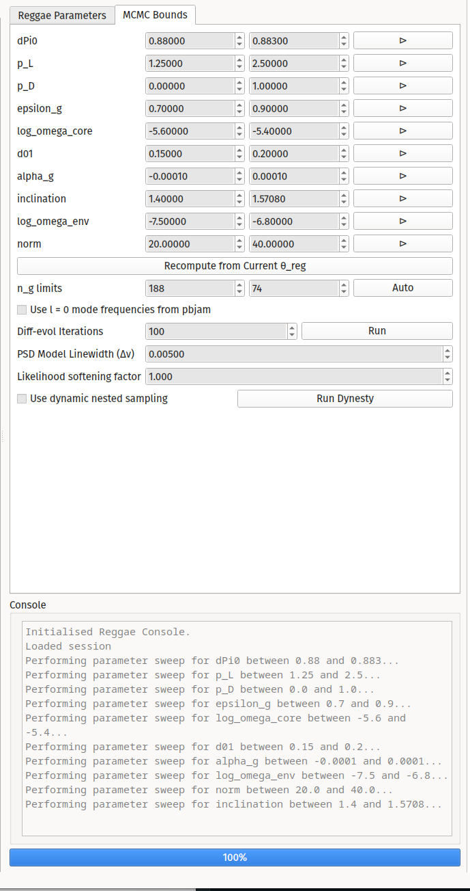

# Usage

Reggae is intended to be operated primarily through its GUI, although many GUI actions correspond to methods of the {class}`~reggae.dipolestar.DipoleStar` class. There are a couple of ways to launch the GUI:

- Executing the `reggae` module from the command line: `python -m reggae`. This will launch an empty instance of the GUI.
- Instantiating a {class}`~reggae.qtconsole.ReggaeDebugWindow`. Passing it no arguments will launch an empty instance, while passing it a `pbjam.star.star` or {class}`~reggae.dipolestar.DipoleStar` object will open that object in the GUI.

## Left Panels: Diagnostic Information

As a diagnostic utility, Reggae exposes a large amount of information to the viewer. This information is broken down in to several panels, which are switchable with the tab bar on the left side of the screen.

### Power Spectrum

The first panel shows the power spectrum. Like `pbjam`, Reggae uses the so-called SNR power spectrum (i.e. with a smooth background divided out) as its focus is on fitting individual peaks — this is shown in black. To further focus on the dipole modes, a model of the radial and quadrupole modes inherited from `pbjam` is further divided out — this is shown in blue. Thus, any residual peaks are those ignored by `pbjam`, which, a priori, are primarily dipole modes. However, the user should ensure that `pbjam`'s model works as expected before proceeding further. The black and blue curves should agree except at the locations of `pbjam`'s identified radial and quadrupole modes, at which locations there should be exactly two peaks at a time in the black curve that are not reflected in the blue.

Later steps in the fitting procedure, using different optimisation schemes, may produce estimates of the parameters as well, each also corresponding to a PSD model. These are shown with various coloured curves.

### $\chi^2$ Landscape

This panel displays the values of $\chi^2 = -\log \mathcal{L}$ as a function of each of the optimisation parameters, holding the others constant at their current values, should the user initiate a parameter sweep (see Right Panel 2 below).

### Echelle Diagrams

Given that the p- and g-modes are known to separately possess characteristic frequency and period spacings, respectively, it is conventional to examine the locations of these peaks in the power spectrum through the use of "echelle power diagrams". This third panel shows such diagrams, where the power spectrum is phase-folded with respect to these frequency or period spacings on the horizontal axis.

Reggae's mode identification step turns a small number of parameters — such as $\Delta\Pi$, $\epsilon_g$, coupling strengths, and core/envelope rotation rates — into a large number of mode frequencies and heights, each one corresponding to a peak in the power spectrum associated with a mode of mixed p-like and g-like character. A good set of Reggae's parameters should also result in mode frequencies, placed on these diagrams, that align visually with local maxima in the power spectrum.

For the period-echelle power diagram in particular, the horizontal coordinate is further "stretched" through the use of the coordinate transform described in Mosser et al. 2012, 2015, 2017, 2018; Ong & Gehan 2023. In summary: in the asymptotic regime, mixed modes satisfy an eigenvalue equation parameterised by a single coupling strength $q$. If ansatz values of $q$, $\Delta\Pi$, and the pure p-mode frequencies are supplied, this allows the pure g-mode frequencies to be inferred from the mixed modes analytically. More generally, this specifies a coordinate transformation in the period coordinate mapping the mixed mode frequencies to the g-mode frequencies. As such, when applied to the period-echelle power diagram, it will map avoided crossings to vertical ridges, if the supplied values of $q$, $\Delta\Pi$, and the p-mode frequencies are accurate.

### Posterior Distribution

In addition to finding optimal point estimates, Reggae also allows the dipole-mode parameters to be determined by nested sampling. This panel simply displays the corner plot of the joint posterior distribution for the dipole-mode model parameters.

## Right Panels: Tuning Parameters

Reggae is intended to permit the user to derive estimates of parameters describing the dipole modes. As such, its GUI provides various ways by which one might either manually fine-tune a guess at these parameters, or else arrive at point esimates or posterior distributions through automated optimisation or sampling. These options are shown on the right side of the screen. Again, they are broken down into several panels, which are switchable with the right tab bar.

### Manual Tuning

This panel allows the user to manually fine-tune the numerical values of a set of dipole-mode parameters. `pbjam` will use a generative model for dipole gravitoacoustic mixed modes using the parameterisation of Ong & Basu (2020), with the frequency-dependent coupling strength described with two parameters (one for each of the two matrices entering into the parameterisation). The full set of parameters in the model, $\theta_\text{reggae}$, is thus:

- $\Delta\Pi_0$, the notional period spacing of the g-mode cavity; this is related to the period spacing of any given $\ell$ as $\Delta\Pi_\ell = \Delta\Pi_0 / \sqrt{\ell(\ell + 1)}$.
- $p_L$ and $p_D$, the two coupling parameters described above.
- $\epsilon_g$, a g-mode phase offset.
- $\log \left(\delta\omega_\mathrm{rot, g} / \mathrm{\mu Hz}\right)$ and $\log \left(\delta\omega_\mathrm{rot, p} / \mathrm{\mu Hz}\right)$ --- the implementation of the PSD model (below) accepts separate values of the core (g-mode) and envelope (p-mode) rotational splittings. The pure p- and g-modes are split into multiplets separately before mode-coupling calculations are performed, thereby fully accounting for near-degeneracy asymmetric rotational splittings.
- $\delta_{01}$, an additional phase offset for the dipole p-modes relative to the asymptotic solution found by pbjam.
- $\alpha_g$, a curvature parameter for the g-modes (mirroring that of the p-modes in `pbjam`'s asymptotic parameterisation).
- $i$, the inclination of the rotational axis, and
- `norm`, the height-to-background ratio of the envelope dipole-mode (being a Gaussian centred at $\nu_\text{max}$ for solar-like oscillators). This is fitted independently of `pbjam`'s estimate of it for even-degree modes.

The numerical values for Reggae's current "manual" value of these parameters are thus shown, and may be modified, at the top of this panel. This is immediately followed by the control for running a simplex optimisation using the manual values as an initial guess. The best-fitting result for the simplex optimisation is saved independently of the manual value.

These are followed by several plotting options for the échelle-diagram panel. Specifically, the user may opt to show or hide the mode frequencies associated with optimal model parameters from various optimisation schemes, as well as whether or not to display the sectoral modes (in addition to the zonal modes). The user may also force the recomputation of the mode frequencies.

Following this, there are options specifying how the stretched period-echelle diagram (bottom half of the échelle-diagram left panel) is to be constructed. Stretched diagrams of this kind require the pure p-mode frequencies, the dipole-mode period spacing, and the asymptotic coupling strength $q$ to be specified. The first two are computed from the current manual estimate of the dipole-mode parameters, while the user may choose to input a manual guess for the value of $q$. If desired, the conversion to the asymptotic $q$ provided by an expression in Ong & Gehan (2023) is also available. Plotting options (e.g. the ability to produce a replicated echelle diagram) are also exposed here

Finally, there is a textbox for debug commands to be issued. This is to permit advanced manual manipulation of the {class}`~reggae.dipolestar.DipoleStar` object, and most users will not need to worry about this.

### Bounds and Other Options

Several of the numerical methods exposed to the user require bounds (for optimisation, or for uninformative priors) to be specified. Upper and lower bounds to ranges of values for all of the parameters described above may thus be entered here. On the right side of each row is a "play" button, which initiates a parameter sweep for values of the log-likelihood function $\chi^2 = -\log \mathcal{L}$, whose results are shown in Left Panel 2. The corresponding entry of $\theta_\text{Reggae}$ in Right Panel 1 is automatically set to the optimal value after performing such a sweep. The user may also recompute these bounds automatically around the current manual values of $\theta_\text{Reggae}$.

The matrix formalism also requires a set of g-mode frequencies to be specified, which we determine with a user-specified range of $n_g$, so that in the asymptotic parameterisation $1/\nu_g \sim \Delta\Pi_\ell (n_g + \epsilon_g + \alpha_g(n_g - n_{g,\text{max}}))^2$. Upper and lower values of $n_g$ (inclusive) may be provided here.

The pure p-mode frequency for each $n_p$ is also computed as $\nu_{1, n_p} = \nu_{0, n_p} - {1 \over 3}\delta_nu_{02, n_p} + \Delta\nu({1 \over 2} + d_{01})$, where $\nu_{0, n_p}$ is the radial-mode frequency at that radial order, $\Delta\nu$ is the asymptotic large separation, and $\delta\nu_{02, n_p}$ is the local small separation. The user may opt to specify whether `pbjam` asymptotic or fitted values for the even-degree p-mode frequencies are used in this expression.

Finally, there are controls for various optimisation and sampling schemes.

## Toolbar: I/O Operations

The right toolbar contains text buttons performing file I/O operations. These are:

- Import PBJam: Load a pickle file containing the results of a PBJam run (i.e. a `pbjam.star` object), and populate the user interface.
- Load Reggae: Load a pickle file containing an existing {class}`~reggae.dipolestar.DipoleStar` object, and populate the user interface.
- Dump Session: Save the current state of the GUI to a pickle file.
- Load Session: Load a saved GUI state from a pickle file.
- Reset: Reset the currently-running {class}`~reggae.qtconsole.ReggaeDebugWindow`.