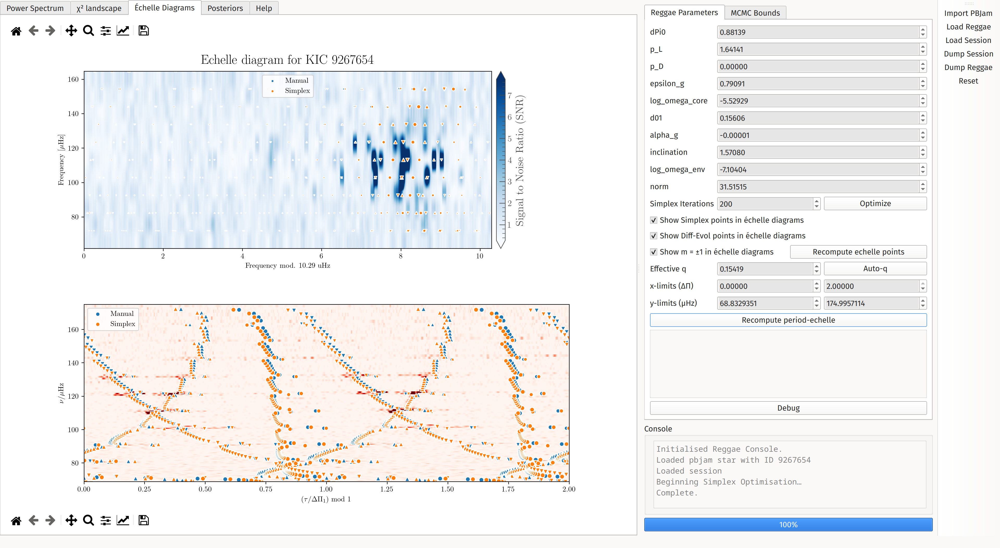

# Summary

`PBjam` [@{2021AJ....161...62N}] is a software instrument for fitting solar-like oscillation modes ("peakbagging\") in power spectra from space-based photometry. Its upcoming second release [@pbjam2] supplements the simple power-spectrum model used in the first version --- which included only radial and quadrupole ($\ell = 0, 2$) modes --- to additionally constrain other features [e.g. @{2023A&A...676A.117N}]. Dipole ($\ell = 1$) modes, which had been specifically excluded in the initial version of the tool owing to their complexity, are now specifically included. Since the primary samples of the PLATO mission consist mainly of main-sequence and subgiant stars [@plato], `PBjam` implements a parameterisation of dipole mixed-mode frequencies --- as described by their overtone spacings, boundary conditions, and other stellar properties --- that is suitable to these stars, outside the red-giant "asymptotic" regime. In keeping with the overall philosophy of `PBjam`'s design for $\ell = 0,2$, `PBjam` 2 will specify prior distributions on these parameters through an empirical prior sample. While the red giant regime has been extensively characterised observationally, the nonasymptotic construction here has not, requiring us to construct this prior sample ourselves. To assist in this task, we built a tool --- `Reggae`--- to manually fine-tune and fit the dipole-mode model, and check the quality of both our initial guesses and fitted solutions.

# Statement of Need

Before mode frequencies may be extracted from the power spectrum, specific peaks in it must be identified as dipole modes. An important part of this identification is visual assessment of how well the predicted mode frequencies correspond to actually observed peaks. `Reggae` produces these visualisations from user-supplied trial values. This is useful for checking solutions of, e.g., the period spacing $\Delta\Pi_1$ --- inaccurate values result in slanted ridges on period-echelle diagrams, much like with inaccurate $\Delta\nu$ in traditional frequency échelle diagrams. Similarly, rotational splittings become easily identifiable, as are any perturbations due to magnetic fields.

Since these global parameters must be supplied for dipole-mode identification, we have constrained them for a preliminary sample of subgiants [@pbjam2], and also for a large sample of low-luminosity red giants [@hatt]. We found `Reggae` very helpful both for these tuning and visualisation tasks, and also as a didactic aid to understanding the dipole mixed-mode parameters. As such, we release it publicly in advance of the second `PBjam` version, as we believe the community will benefit from access to such a visualisation tool. This will also assist future users of `PBjam` in devising ad-hoc prior constraints on the mixed-mode parameters, should they wish to perform mode identification for anomalous stars.

# Modeling the Oscillation Spectrum

`Reggae` uses individually-fitted modes from `PBjam` to construct a model of the $\ell=2,0$ modes, which is then divided out of the signal-to-noise spectrum; this allows the optimization and visualization of the $\ell=1$ mode identification to be performed independently, and far more simply. The dipole p-mode frequencies are parameterised identically to `PBjam`, with a small frequency offset $d_{01} \times \Delta\nu$ to account for imperfections in this idealised asymptotic description.

To produce mixed modes, we must specify both pure g-mode frequencies --- which we describe using a period spacing $\Delta\Pi_1$, a g-mode phase offset $\epsilon_g$, and an analogous curvature parameter $\alpha_g$ to that used in the p-mode parameterisation --- as well as coupling between the p- and g-modes. For this `PBJam` will adopt the matrix-eigenvalue parameterisation of @deheuvels_insights_2010, supplemented with a secondary inner-product matrix as described in @ong_semianalytic_2020 to account for the nonorthogonality of the notional pure p- and g-mode eigenfunctions. This parameterisation is used instead of the classical asymptotic description [e.g. @{1979PASJ...31...87S}] in light of its intended application to subgiants specifically. Numerically, these matrices are scaled from values supplied by a reference MESA model [from the grid of @lindsay] using parameters $p_\mathrm{L}$ and $p_\mathrm{D}$. The correspondence between these matrices and the classical coupling strength $q$ is described in @ong_rotation_2023. Rotation in the p- and g-mode cavities are separately parameterised with $\log \Omega_\mathrm{p}$ and $\log \Omega_\mathrm{g}$, and a shared inclination parameter $i$, with rotating mixed modes computed fully accounting for near-degeneracy effects [e.g. @ong_rotation_2022].

`Reggae` fine-tunes these parameters by numerical optimization, which requires a model of the power spectral density (PSD) that can be compared to the observed residual spectrum. This model is a sum of Lorentzian profiles, one for each of the predicted dipole modes. Their linewidths are artificially broadened to a fraction of $\Delta\nu$, smoothing over local minima in the likelihood function. Their heights follow the same Gaussian envelope as `PBjam`'s model for the $\ell=2,0$ pairs, with additional modulation by mixing fractions $\zeta$ from mode coupling.

These visualization and tuning features are operated through a graphical user interface (GUI), illustrated in \autoref{fig:screenshot}. The visualisation tools are provided on the left of the interface. Manual guesses and parameter bounds provide initial guesses for simplex or genetic-algorithm optimization. Alternatively all parameters can be sampled at once using the Dynesty nested sampling package [@dynesty].

# Acknowledgments

JMJO acknowledges support from NASA through the NASA Hubble Fellowship grants HST-HF2-51517.001-A, awarded by STScI, which is operated by the Association of Universities for Research in Astronomy, Incorporated, under NASA contract NAS5-26555. MBN acknowledges support from the UK Space Agency.
