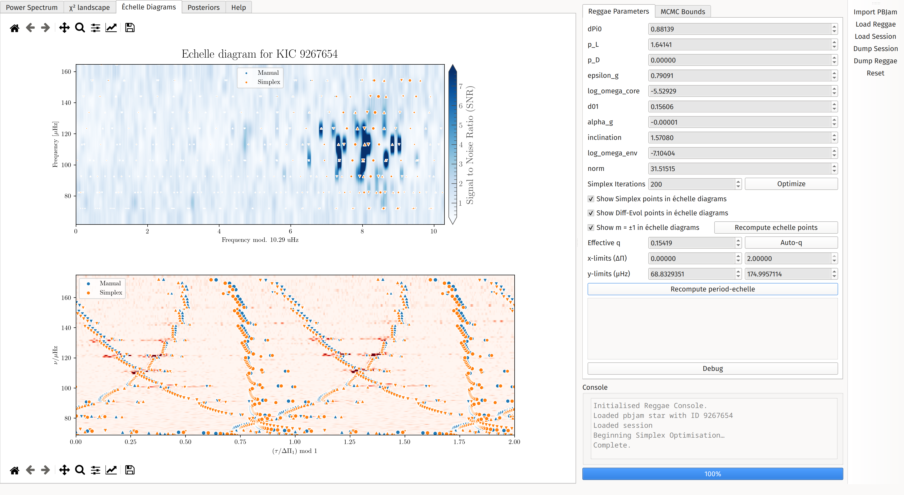

# Summary

`PBjam` [@{2021AJ....161...62N}] is a software instrument for fitting solar-like oscillation modes ("peakbagging\") in photometric power spectra returned from space missions like Kepler and TESS. Its upcoming second release (Nielsen et al. in prep.) supplements the simple model of the power spectrum used in the first version --- which included only radial and quadrupole ($\ell = 0, 2$) modes --- to additionally constrain more spectral features [e.g. @{2023A&A...676A.117N}]. Dipole ($\ell = 1$) modes, which had been specifically excluded in the initial version of the tool owing to their potential morphological complexity, are now specifically included. In keeping with the overall philosophy of `PBjam`'s design for $\ell = 0,2$, we are building a prior sample distribution of asymptotic parameters for these dipole modes. To assist in this task, we built a tool --- `Reggae`--- to manually fine-tune the dipole-mode model, and check the quality of both our initial guesses and fitted solutions.

# Statement of Need

An important part of this tuning is visual assessment of how well the data matches posterior samples for these parameters. Such asteroseismic visualisations often use the échelle power diagram near $\nu_{\mathrm{max}}$ as a diagnostic tool, with clearly-defined ridges emerging on this diagram for p-modes, such as in main-sequence stars. Gravitoacoustic mixed dipole modes in evolved stars, however, present more complicated features, making the distribution of mode power less visually intuitive in frequency space (see top frame of \autoref{fig:screenshot}). One may alternatively construct period-échelle power diagrams, correcting for mixed-mode coupling, to accommodate the asymptotic properties of g-modes, thereby again producing clear ridges. `Reggae` produces these visualisations from user-supplied trial values. This is useful for checking solutions of, e.g., the period spacing $\Delta\Pi_1$ --- inaccurate values result in slanted ridges, much like with inaccurate $\Delta\nu$ in traditional frequency échelle diagrams. Similarly, rotational splittings become easily identifiable, as are any perturbations due to magnetic fields.

We have constrained these global parameters for a preliminary sample of subgiants (Nielsen et al. in prep.), and also for a large sample of low-luminosity red giants [@hatt]. We found it very helpful both for these tuning and visualisation tasks, and also as a didactic aid to understanding the dipole mixed-mode parameters. As such, we release it publicly in advance of the second `PBjam` version, as we believe the community will benefit from access to such a visualisation tool. This will also assist future users of `PBjam` in devising constraints on the mixed-mode parameters, should they wish not to rely on the prior included with it.

# Modeling the Oscillation Spectrum

`Reggae` picks up immediately where `PBjam`'s analysis leaves off, using a model of the $\ell=2,0$ model computed from the summary statistics of marginalized posterior from `PBjam`. This model is divided out of the signal-to-noise spectrum, thereby allowing the optimization and visualization of the $\ell=1$ mode solutions to be performed independently, and far more simply. The dipole p-mode frequencies are parameterised identically to `PBjam`, with a small frequency offset $d_{01} \times \Delta\nu$ to account for imperfections in this idealised asymptotic description.

To produce mixed modes, we must specify both pure g-mode frequencies --- which we describe using a period spacing $\Delta\Pi$, a g-mode phase offset $\epsilon_g$, and an analogous curvature parameter $\alpha_g$ to that used in the p-mode parameterisation --- as well as coupling between the p- and g-modes. For this `PBJam` will adopt the matrix-eigenvalue parameterisation of [@deheuvels_insights_2010], supplemented with a secondary inner-product matrix as described in [@ong_semianalytic_2020] to account for the nonorthogonality of the notional pure p- and g-mode eigenfunctions. This parameterisation is used instead of the classical asymptotic description [e.g. @{1979PASJ...31...87S}] in light of its intended application to subgiants specifically. Numerically, these matrices are scaled from values supplied by a reference MESA model [from the grid of @lindsay] using parameters $p_\mathrm{L}$ and $p_\mathrm{D}$. The correspondence between these matrices and the classical coupling strength $q$ is described in @ong_rotation_2023. Rotation in the p- and g-mode cavities are separately parameterised with $\log \Omega_\mathrm{p}$ and $\log \Omega_\mathrm{g}$, and a shared inclination parameter $i$, with rotating mixed modes computed fully accounting for near-degeneracy effects.

`Reggae` fine-tunes these parameters by numerical optimization, which requires a model of the power spectral density (PSD) that can be compared to the observed residual spectrum. This model is a sum of Lorentzian profiles, one for each of the predicted dipole modes. Their linewidths are artificially broadened to a fraction of $\Delta\nu$, smoothing over local minima in the likelihood function. Their heights follow the same Gaussian envelope as `PBjam`'s model for the $\ell=2,0$ pairs, with additional modulation by mixing fractions $\zeta$ from mode coupling.

These visualization and tuning features are operated through a graphical user interface (GUI), illustrated in \autoref{fig:screenshot}. The visualisation tools are provided on the left of the interface. Manual guesses and parameter bounds provide initial guesses for simplex or genetic-algorithm optimization. Alternatively all parameters can be sampled at once using the Dynesty nested sampling package [@dynesty].

# Acknowledgments

JMJO acknowledges support from NASA through the NASA Hubble Fellowship grants HST-HF2-51517.001-A, awarded by STScI, which is operated by the Association of Universities for Research in Astronomy, Incorporated, under NASA contract NAS5-26555. MBN acknowledges support from the UK Space Agency.

# References